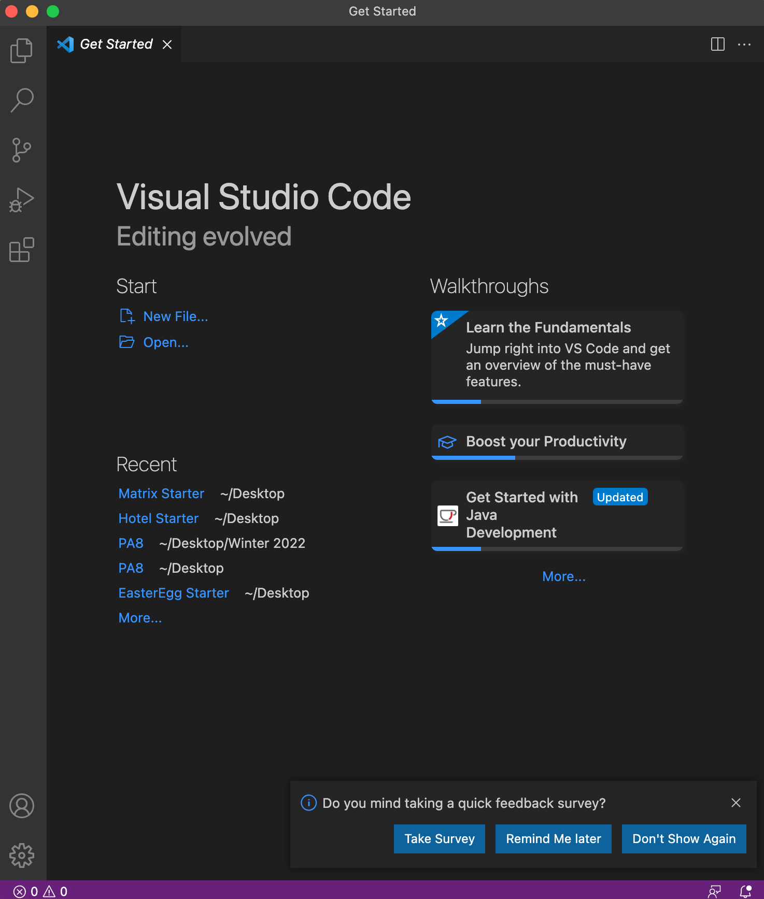

# Week 2 Lab Report
Welcome to my tutorial. On this page, I will guide you through how to:

* Install Visual Studio Code
* Remotely connect to a server
* Use some basic commands
* Move files using the `scp` command
* Set an SSH Key
* Optimize Remote Running

Follow along!

## Installing Visual Studio Code

In order to download Visual Studio Code, you must first direct yourself to the [Visual Studio Code](https://code.visualstudio.com/) website

> Note that there are different versions of VS code that should be downloaded based off of your device. This tutorial is based off a OSX (Mac) device

Once you click the link, hit the **DOWNLOAD** button and install the application on your device.

Once downloaded, open the application. You should see an a screen like/similar to this:

> This is your **Homepage**.

**Congrats! You have succsessfully downloaded and installed Visual Studio Code!**
